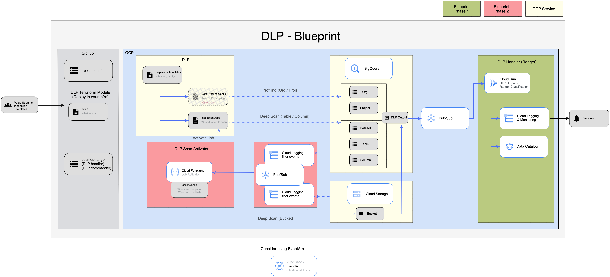

---
tags:
- Data Enablement
- Data Loss Prevention
---
## Summary

GCP Cloud DLP API provides both

1. Data profiling (for PII/PCI data) and
2. Table / column deep scanning

to detect potential data leak. These APIs provide two use-cases to ANZx initiative, starting with Cosmos folder. The use-cases are:

1. Detect BigQuery column misclassification (Data profiling output matched against Ranger's data product)
2. Detect PII/PCI and notify any detections for onboarded tables / columns / GCS bucket (deep scanning)

This decision is used to capture discussions to the architecture, and solve for these two use-cases, as there are many ways to skin the cat especially when we want to provide this capability to as wide an audience as possible without having to copy the code in other ANZx folders.

The implementation of DLP will also satisfy [CODEX control PAC-231](https://codex.service.anz/app/#main/1/pacts/edit?id=2ft6k0678w3ec49p8r20dz1k3v) relating to data loss prevention.

## Goals and non-goals

__Goals__:

- Determine if design is robust and meets requirements in the best possible way
- Attain idempotency and team independent pipeline that can be containerised and run anywhere
- Help consider if integration into mesh-x modules is appropriate, when data poducts are created using mesh-x modules
- Stretch goal: Understand if there's possibility for it being an automatic-deployment blueprint so that value-streams can enrol their assets without having to go to production

__Non-goals__:

- CODEX controls definition

## Decision Details

Note: Architecture diagram can be edited in [Google's Excalidraw](https://googlecloudcheatsheet.withgoogle.com/architecture).

### 👀️ Component Details

##### 🏷 DLP Terraform module (... that is provided by xDE)

* Create default Inspection Template and any custom define scan Info Types
* Define in variables and create the table / column / bucket to scan (jobs)
* Define steps to manually enable data profiling (ClickOps)
* Creates BQ dataset to store scan output
* Creates PubSub to notify scan output
* Creates resources to detect updates to the enrolled items, to 'activate' a scan job
  * Either a combination of Logging filter + Monitoring, or
  * EventArc
* DLP Commander: Generic Cloud Function to activate job on scan item update event

##### 🏷 DLP logics (... that is part of Kaiju's Ranger):

* Cosmos-infra DLP component: Uses the module
* DLP Handler: Cloud Run image, joins output with Ranger, identify and notify misclassification, publish tag to GDC

## Benefits

- Looking at the [Acceptance Criteria](https://confluence.service.anz/display/ABT/Acceptance+Criteria), providing reusable module as blueprint allows charges to project-owner where DLP is instantiated
- Works with Ranger's GDC integration
- Completely serverless
- Allow for versioned blueprint, future upgrades when DLP Terraform is available

## Caveats

* v1: All the Terraform resources above and containers, scheduled jobs
* v2: Figure out how to DLP scan on BQ insert or bucket file upload / update event (EventArc?)
* Future:
  * Metadata-driven DLP scan (SYSL) or
  * GDC-driven DLP scan
  * High risk column / bucket quanrantine (policy tag to quarantine until exempted)
* Data Profiling is Click-Ops at the moment, no REST API or Terraform module. Need to provide steps to enable in Console.
* Costs:
  * Profiling (sampling of data) costs USD 0.03/GB, much lower than
  * Inspection job deep scan (row-by-row), costs USD 1.00/GB
* Deidentification service will not be provided as we will handle mask-on-read using GDC Policy Tagging

## References

[Cosmos DLP Confluence page](https://confluence.service.anz/display/ABT/Cosmos+DLP)
